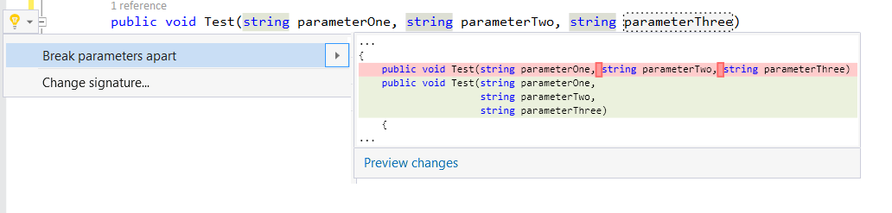
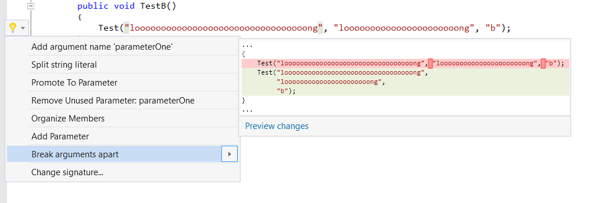
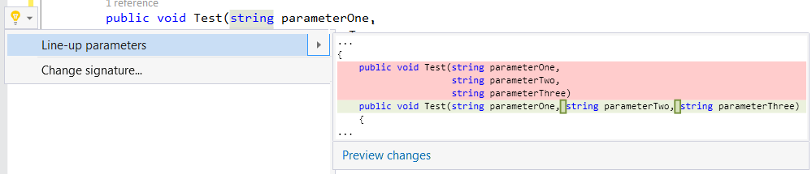
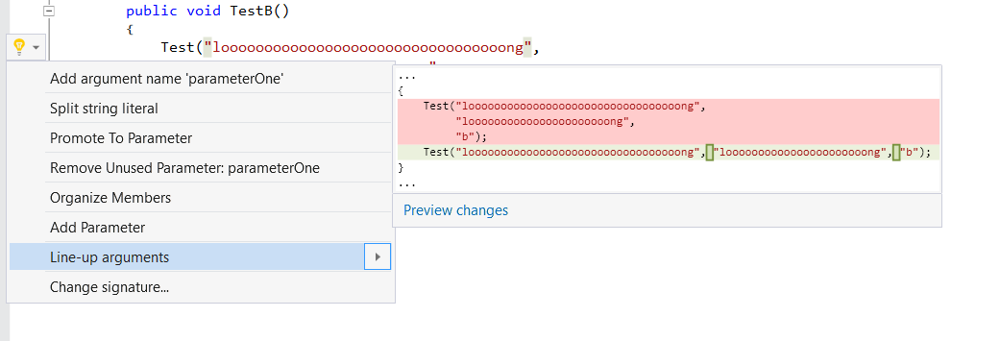

# MarketInvoice Roslyn Pack

Contains various refactorings, code analysis and code fixes for Visual Studio.

# Download and Install

|||
|--|--|
|Visual Studio Extension Download| [Download](https://visualstudiogallery.msdn.microsoft.com/9a7f4b28-f068-4417-a021-8a770d352ea9) |
| Stable CI build |  |

## Refactorings

### 1. Break parameters and arguments apart

### 2. Line-up parameters and arguments

